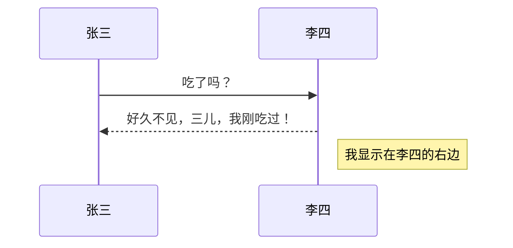
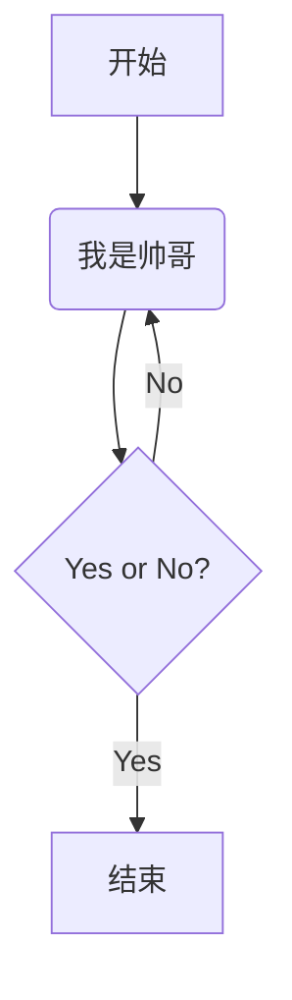
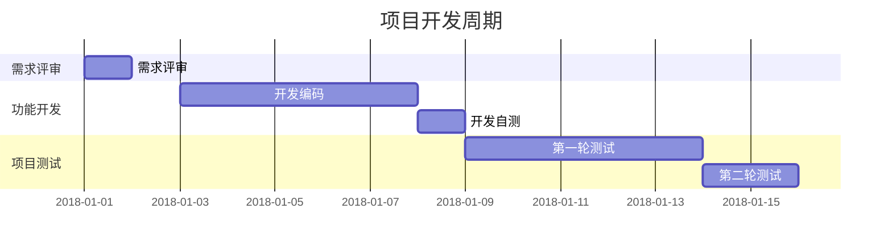

# Markdown笔记

# 第二章 Markdown 语法

## 基础语法

---

###  字体

#### 标题

1.  使用底线的语法

```markdown
标题内容
========
或者
标题内容
--------
```

-   底线 == 表示一级标题
-   底线 --- 表示二级标题
-   底线符号至少2个
-   这种语法只支持两级标题

2.  使用 # 的语法（推荐）

```markdown
# + 空格 + 标题内容
```

-   \# 的个数代表标题的等级
-   在\# 后面添加一个空格
-   Markdown中最多支持前6级标题

注意：

-   要保持间距，建议标题的前后都要空 1 行
-   \# 与标题文本之间也要有 1 个空格，否则会导致阅读困难
-   不要有多余的空格：建议标题要写在一行的开头，结尾也不要有空格
-   建议标题的结尾不要有标点符号
-   建议标题要尽量简短，方便引用

#### 粗体和斜体

粗体语法

```markdown
**加粗的内容**
或
__加粗内容__
```

斜体语法

```Markdown
*斜体内容*
或
_斜体内容_
```

注意：

-   粗体和斜体建议使用 * 语法
-   粗体和斜体内容建议不要有空格

#### 高亮

语法：

```markdown
==文字==
```

#### 下划线

语法：

```markdown
<u>文字</u>
```

<u>下划线</u>

#### 脚注

语法：

```markdown
我们可以这样引用一个脚注[^脚注]

[^脚注]:脚注的说明
```

示例：

我们可以这样应用一个脚注[^参考]

[^参考]:飒飒的

---

### 段落

​	Markdown 中的段落由一行或多行文本组成，不同段落之间使用空行来标记

-   语法说明

​    1） 如果行与行之间没有空行，则会被视为同意段落

​	2） 如果行与行之间有空行，则被视为不同的段落

​	3） 空行是指行内什么都没有，或者只有空格或者制表符

​	4） 如果想在段内换行，则需要在上一行的结尾插入两个以上的空格然后按回车键

---

#### 列表

-   有序列表的语法

```markdown
数字序号 + 英文句号 + 空格 + 列表内容
```

-   无序列表语法

```markdown
+/-/* + 空格 + 列表内容
```

-   嵌套列表的语法

```Markdown
- 第一层列表
TAB - 第二层列表
TAB + TAB - 第三层列表
```

​	说明：

​	1） 列表中可以嵌套列表

​	2） 有序列表和无序列表页可以相互嵌套

-   使用规范  

    

    1.  建议使用 - 标记无序列表
    2.  如果一个列表中所有的列表项都没有换行，建议使用一个空格
    3.  如果列表项有换行，则建议给无序列表使用3个空格，给有序列表使用2个空格
    4.  如果一个列表中的每个列表项都只有1行，建议列表项之间不要有空行
    5.  如果列表项中有换行，建议在列表项之间空 1 行，

---

#### 分隔线

-   分割线语法

```markdown
***
或
---
或
___
```

-   语法说明

    1） 分隔线使用至少3个以上的 */-/_来标记

    2） 行内不能有其他字符

    3） 可以在标记符中间加上空格

---

### 图片

-   语法

```markdown

```

-   语法说明

    1） 图片地址可以是网络地址，也可以是本地地址

    2） 本地图片支持相对领和绝对路径两种方式

---

### 链接

#### 1. 文字链接

文字链接就是把链接地址直接写在文本中

语法：

```markdown
[链接文字](链接地址)
```

实例：

[百度](www.baidu.com)

[谷歌](www.google.com)

[GitHub](https://github.com)

#### 2. 引用链接

把链接地址在某个地方统一定义好，然后在正文中通过“**变量**”来引用，可读性一下子就变强

引用链接是把链接地址作为“**变量**”现在Markdown文件的诶不定义好，然后在正文中进行引用

语法：

```markdown
正文中引用链接标记
[链接文字][链接标记]

在底部链接标记
[链接标记]:链接地址
```

实例：

```markdown
[百度][1]


[1]:www.baidu.com
```

[百度][1]

[1]:www.baidu.com

语法说明：

-   链接标记可以有字母、数字、空格、和标点符号
-   链接标记不区分大小写
-   定义的链接内容可以放在任何位置，建议放在尾页
-   当链接地址是网络地址时要以http/https开头，否则会被识别为本地地址

#### 3. 网址链接

将网址或者邮箱用<>包裹起来会自动转换为超链接

语法：

```markdown
<URL 或 邮箱地址>
```

实例：

<18335909110@163.com>

---

### 行内代码与代码块

#### 1. 行内代码

语法：

```markdown
`代码`
```

实例：

使用 `cd ..`命令切换到上一级目录

#### 2. 代码块

代码块以4个空格或者Tab开头

​    printf("hello");

很多扩展语法提供了围栏代码块，并且支持语法高亮

#### 3. 使用规范

-   除行内代码可以使用``包裹以外，转义或者强调某些字符，也可以使用``包裹

示例：

```markdown
若果你想跑路可以执行 `rm -f * /`命令
如果你不想`跑路`请限制执行删除权限
```

-   如果代码超过1行，请使用围栏代码块，并显示的声明语言，这样做便于阅读，并且可以显示语法高亮

示例：

```python
​```python
    print "hello"
​```
```

-   shell命令 中不能换行，因此可以在行尾使用 `\`表示换行
-   建议在有输出内容的Shell命令前加\$，没有输出内容的Shell命令前不要加​\$

---

### 引用

语法：

```markdown
> + 引用内容
```

说明：

-   多行引用也可以在每一行的开头都插入`>`
-   在引用中可以嵌套引用
-   在引用中可以使用其他`Markdown`语法
-   段落与换行的格式在引用中也是适用的

使用规范：

-   建议在引用的标记符号`>`之后添加一个空格
-   建议每一行引用都使用引用符号`>`
-   不要在引用中添加空行

---

### 转义

语法：

```markdown
\特殊符号
```

可以被转义的符号：


## 扩展语法（GFM）

---

### 删除线

语法：

```markdown
~~被删除的文字~~
```

---

### 表情符号

语法：

```markdown
使用：包裹表情代码即可
```

示例：

```markdown
:smile:
```

:smile:

[更多表情符号](https://www.webfx.com/tools/emoji-cheat-sheet/)

---

### 自动连接

标准语法中使用`<>`包裹的URL地址被自动是别并解析为为超链接

扩展语法可以不是用`<>`包裹，自动连接只是别以`www`或`http://`开头的URL地址

如果不想使用自动连接， 也可以使用 `` 包裹URL地址

---

### 表格

语法：

```markdown
|表头1 | 表头2 | 表头3 |
|---- | ---- | -----|
|内容1 | 内容2 | 内容3 |
|内容1 | 内容2 | 内容3 |
```

说明：

-   单元格使用`|`来分割开，建议最前和最后都是用`|`
-   单元格和`|`之间的空格会被移除掉
-   表头和其他行使用`----`来分隔
-   表格对其格式如下
    1.  左对齐（默认）：`:----`
    2.  右对齐：`----:`
    3.  居中对齐：`:----:`

-   块级元素（代码区块，引用区块）不能插入表格中

---

### 任务列表

语法：

```markdown
- [ ] 未勾选
- [x] 已勾选 
```

示例：

-   [ ] 喝

-   [x] 吃
    -   [ ] 睡

---

### 围栏代码块

语法：

```markdown
​```语言类型
代码片段
​```
或者
~~~语言类型
代码片段
~~~
```

语法说明：

使用连续 3个 \` 或者3个`~~~`包裹

---

### 锚点

​		锚点，也称书签，用来标记文档特定位置，使用锚点可以跳转到当前文档或者其他文档中指定的标记位置

​		Markdown会被选人成`HTML`，在`HTML`页面中可以通过`锚点`实现跳转；Github、GitBook项目文档中的目录也是通过锚点实现跳转的

语法：

```markdown
[锚点描述](#锚点名)
```

说明：

-   锚点名建议使用字母和数字
-   锚点名区分大小写
-   锚点名中不能含有空格，也不能含有特殊字符

示例：

[基础语法](#基础语法)

## 排版技巧

---

### 关于空格

**一些需要加空格的情况**

-   中文或者英文和数字之间要加空格
-   英文标点符号和后面的字符之间
-   当在中文、英文中使用`>`表示路径时，两边都需要加空格

**不加空格的情况**

-   中文标点符号和数字、中文、英文之间不需要添加空格
-   数字和百分号之间
-   数字和单位符号之间
-   英文和数字组合成的名字之间
-   当`/`表示“或”、“路径”时，与前后的字符之间
-   货币符号之间
-   负号后不加空格

### 全角和半角

-   全角：中文标点符号，占两个字节
-   半角：英文标点符号和数字，占 1 个字节

-   中文排版中，使用全角
-   英文排版中，使用半角

### 正确的英文大小写

-   专有名词要使用正确的大小写

# Typora

## 编辑样式

| 操作       | 快捷键           |
| ---------- | ---------------- |
| 加粗       | Ctrl + B         |
| 斜体       | Ctrl + I         |
| 行内代码   | Ctrl + Shift + ` |
| 插入图片   | Ctrl + Shif + I  |
| 超链接     | Ctrl + K         |
| 链接引用   | 无               |
| 删除线     | Alt + Shift + 5  |
| 表情与符号 | 无               |

### 标题

| 操作            | 快捷键   |
| --------------- | -------- |
| 设置为 `n` 标题 | Ctrl + n |
| 提升标题级别    | Ctrl + = |
| 降低标题级别    | Ctrl + - |
| 设置为普通文本  | Ctrl + 0 |

### 列表

| 操作         | 快捷键           |
| ------------ | ---------------- |
| 添加有序列表 | Ctrl + Shift + [ |
| 添加无序列表 | Ctrl + Shift + ] |
| 增加缩进     | Ctrl + ]         |
| 减少缩进     | Ctrl + [         |
| 添加任务列表 | 无               |
| 切换任务列表 | 无               |

### 引用和水平分割线

| 操作           | 快捷键           |
| -------------- | ---------------- |
| 添加引用       | Ctrl + Shift + Q |
| 添加水平分割线 | 无               |

### 表格

| 操作     | 快捷键           |
| -------- | ---------------- |
| 插入表格 | Ctrl + T         |
| 增加一行 | Ctrl + Enter     |
| 减少一行 | Ctrl + Backspace |

### 代码

插入代码围栏

| 操作         | 快捷键           |
| ------------ | ---------------- |
| 插入代码围栏 | Ctrl + Shift + K |

## 扩展样式

### 下划线

语法：

```Markdown
<u>这段文字有下户线</u>

快捷键： Ctrl + U
```

---

### 内联数学公式

`需要开启设置：【偏好设置】→【Markdown】→【Markdown扩展语法】→【内联公式】`

语法：

```markdown
$数学公式$
```

示例：

```markdown
分数： $ f(x, y) = \frac{x^2}{y^2} $
开根号: $ f(x, y) = \sqrt[n]{{x ^ 2} {y ^ 3}} $
省略号: $ f(x_1, x_2, \ldots, x_n) = x_1 + x_2 + \cdots + x_n $
```

$ f(x, y) = \frac{x^2}{y^2} $

$ f(x, y) = \sqrt[n]{{x ^ 2} {y ^ 3}} $

$ f(x_1, x_2, \cdots, x_n) = x_1^2 + x_2 + \dots + x_n $

---

### 上标和下标

语法：（对比公式中的上标和下标）

```markdown
~下标内容~

^上标内容^
```

示例：

H~2~O

x^2^ + y^2^

---

### 高亮

语法：

```markdown
==高亮内容==
```

---

### 注释

语法：

```markdown
<!--我是注释-->
```

<!--注释-->

说明：

-   在编辑好预览时，注释的内容会被显示
-   在导出 PDF 或 Word 时，注释会被隐藏

---

### 清除样式

```markdown
快捷键： Ctrl + \
```

---

### 数学公式块

语法：

```markdown
$$
数学公式
$$

快捷键：Ctrl + Shift + M
```

示例：
$$
\mathbf{V_1} \times \mathbf{V_2} = \begin{vmatrix}

\mathbf{i} & \mathbf{j} & \mathbf{k} \\

\frac{\partial X}{\partial u} & \frac{[\partial Y]}{\partial u} & 0 \\

\frac{\partial X}{\partial v} & \frac{\partial Y}{\partial v} & 0 \\

\end{vmatrix}
$$

---

### 目录

语法：

```markdown
[TOC]
```

使用说明：

在需要插入目录的地方输入`[TOC]` 回车即可

---

### 脚注

我们可以这样引用一个脚注[^测试]

[^测试]: 这是脚注

---

### 图表

#### 序列图

Typora提供的序列图语法标记功能是基于开源项目[js-sequence-diagrams](https://bramp.github.io/js-sequence-deagrams)

语法：

```markdown
​```sequence
js-sequence-diagrams 语法
​```
```

示例：

```sequence
张三->李四:李四，吃了吗？
Note right of 李四:我显示在李四的右边
李四->张三: 好久不见，三儿，我刚吃过！
```

#### 流程图

Typora 提供的流程图语法标记是基于开源项目[flowchart.js](http://flowchart.js.org/)

语法：

```markdown
​```flow
flowchart 语法
​```
```

示例：

```flow
st=>start: 开始
op=>operation: 我是帅哥
cond=>condition: Yes or No?
e=>end: 结束

st->op->cond
cond(yes)->e
cond(no)->op

```

#### Mermaid

Typora 继承了Mermaid, Mermaid 支持使用文本的方式生成图表

##### Mermaid 序列图语法

[语法参考链接](https://knsv.github.io/mermaid/#loops32)

示例：

```markdown
​```makdown
%% 序列图举例（注释）
sequenceDiagram
	张三->>李四: 吃了吗？
	李四-->>张三: 好久不见，三儿，我刚吃过！
	Note right of 李四: 我显示在李四的右边
​```
```



##### Mermaid 流程图

[语法参考链接](https://github.io/mermaid/#graph18)

示例：

```markdown
​```mermaid
graph TD
A[开始] -->B(我是帅哥)
B --> C{Yes or No?}
C -->|Yes| D[结束]
C -->|No| B
​```
```




##### Mermaid 甘特图

[语法参考链接](http://knsv.github.io.mermai/index.html#/mermaid-cli)

示例：




